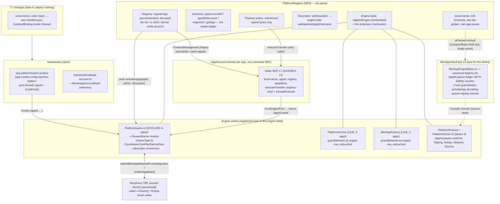

# Platform Contract Library v2 — Registry-Anchored Engine Estate

**Status:** Final synthesized architecture (proposal RADE skeleton × Estate-v2-Minimal mechanism corrections × RMAA extension model, per the two judge reports)
**Audience:** neo-miniapps-platform maintainers
**Landing path:** `docs/platform-contract-library-v2.md`
**Ground truth:** the 2026-07-16 estate census (HEAD `020b53d87`, raw lane results in `docs/archive/claudedocs/contract-estate-census-2026-07-16.md`); every number below is cited from it. Trust the tests, not the README — `contracts/README.md` is measurably stale.

---

## 1. Vision & non-goals

### Vision

The platform contract suite provides so much generic on-chain functionality that a miniapp or game deploys **nothing** (lane A: register an appId + descriptor on a shared engine) or only a **thin DevPack shim** (lane B: bespoke logic over shared source, since Neo N3 has no deployed-code inheritance). The hard requirement is satisfied structurally: **registration mints a deterministic, unique abstract-account address for every registered app** — a real contract-account (contracts ARE accounts on Neo N3) that holds NEP-17, receives fee sweeps and sponsorships, funds engine pools, and anchors permissions. Registration is the app's on-chain identity; the account is its treasury primitive.

Three design laws, each derived from a measured failure:

1. **No engine ships without its first tenant's binding cutover in the same release train.** PlatformGame/DeFi/Social were built, audited, and deployed — and have **zero** live bindings today because migration was an afterthought (census lane 6).
2. **The framework's hardcoded ABI is preserved verbatim.** `startGame/finalizeGame/expireGame/withdraw` + reads `freePool/creditOf/activeGameOf/getGame/statsOf`, events `Solved/CreditWithdrawn` (`framework/gamefi/reward-game-sdk.ts:245-252`, `funds.ts:362-386`, `game-facade.ts:350,374`). Keeping these names buys the entire existing client surface for the cost of appId threading.
3. **Apps can always leave.** Timelocked everything, per-app pause autonomy, pause-immune witness-gated exits, and a treasury escape hatch. The recorded defection rationale (kernel coupling, trust path, upgrade autonomy — census lane 6 "history arc") is answered by credible exit, not by promises.

### Non-goals

- **Not covered, deliberately** (net-new product design, no fleet demand evidence): AMM/swap router (neo-swap's own README gates it behind five enablement conditions), NFT marketplace (no listing/auction/royalty code exists anywhere), prediction markets/insurance, pull-based variable subscriptions (Neo N3 has no allowance primitive), a platform DID registry (adopt external NeoDIDRegistry as a pinned dependency), name service (official NNS **is** the service), plain payments (native tokens suffice). Counting these as covered would repeat the README's stale-docs sin.
- **Not replacing the external AA stack.** UnifiedSmartWallet-V3, session keys, relay, and social recovery remain adopted external dependencies for *user* accounts. The AppAccount is the platform-owned primitive for *app treasuries*. `framework/utils/aa-account.ts` derivations continue unchanged.
- **Not forcing migration** of healthy standalone contracts (the wager quartet: fogplay/dice-game live-validated on CoinFlipV2/DiceGameV2) or of MiniAppCredits (already the working zero-deploy exemplar: shared contract + DB attribution).
- **No chain writes from this workstream.** Testnet/mainnet deployment is the user's action, always behind the existing confirm-phrase tooling. Phase 1 is source + tests only.

---

## 2. Estate today (census numbers)

- **77 apps; 52 bind contracts (57 unique hashes); 25 bind nothing** — one-third of the fleet already lives the zero-deploy vision. Among the unbound are 6-7 *games* (curve-arrow, screw-sort, zhuada-e, arrow-escape, fruit-funnel, bead-workshop, gas-lucky-pool) that would go on-chain the day a shared reward engine exists.
- **42 in-repo contract projects, ~31.1k LOC**: 34 per-app MiniApp\* contracts (20,749 LOC) + 5 platform contracts (9,223 LOC: MiniAppFactory 499, PlatformAnchor 841, PlatformDeFi 2,628, PlatformGame 3,488, PlatformSocial 1,767) + MiniApp.DevPack (875 LOC) + 2 fixtures.
- **Platform adoption is bimodal.** Alive: PlatformAnchor (5 apps, one deployment, the fleet's only permissionless registration — `RegisterCustomAnchorApp`, appAdmin witness + 1 GAS fee from prepaid credit, audit M-11) and MiniAppFactory (3 apps, testnet `0x03a7c8fc…`, digest-verified `ContractManagement.Deploy`, audit A11). Dead: PlatformGame (deployed testnet `0xc311d55e` + mainnet `0xa7840a8d`, **zero bindings** — fogplay was registered on it in May 2026, then defected), PlatformDeFi (testnet `0x39d4584d`, zero bindings), PlatformSocial (no deployment record found; its Vault ABI doesn't even match the live unbreakable-vault app).
- **Why the dead trio died** (recorded, not inferred): a non-operational Morpheus VRF signer dependency (`apps/gasbox/src/composables/useGasBox.ts`), admin-only registration, economics frozen as compile-time consts with a registration config blob **no code ever reads** (`GetGameConfig` exists; no module consumes it; the deploy script passes `[]byte{}`), and no shipped binding migration.
- **The clone family:** 10-11 TEE skill-game contracts of ~811-843 LOC each, >90% identical (~6,800-7,300 duplicated lines). Measured diff AimMaster vs ColorClash: `Play.cs` = **0 lines**; the whole per-game surface is constants (per-difficulty entry/reward/LimitMs/MinSolveMs/TargetScore, dailyCap, `SETTLE_GRACE_MS = 600_000` copied verbatim 11×). JumpRush + SheepSolitaire still carry the superseded bespoke secp256r1 trust model.
- **Duplication census:** 38 `OnNEP17Payment` receivers; 23 `PREFIX_CREDIT` ledgers with total-liability tracking in only **2 of 23**; 3 divergent reentrancy locks; 36 `Update` methods (3 with timelocks); 19 `SetPaused` copies; `AppKey(appId, …)` re-implemented 4×; a de-facto event vocabulary (`CreditWithdrawn` ×27, `Credited` ×25, `Solved` ×20, `PausedChanged` ×13).
- **No on-chain appId→address registry exists.** Runtime truth is `neo-manifest.json` → generated `apps/shared/constants/generated-miniapp-contracts.ts`; deployment truth is spread across build records, hardened-hash snapshots, and coverage reports (including 8 stale deploy-roster rows and **two divergent PlatformAnchor testnet hashes**: manifests `0xab079b4f…` vs update record `0xeb6b3725…`).
- **Constraints:** GAS-only payments, NEO-only governance by blueprint; contract hash = f(sender, nefChecksum, manifestName); no on-chain code sharing (DevPack `Compile Include` is the sharing mechanism, adopted by only 6/39 contracts); the nccs DevPack cannot declare events or `[InitialValue]` on base classes; a FAULTing NEP-17 callback hangs TestEngine.

---

## 3. Architecture

Five contract deliverables plus a DevPack base and framework surfaces. One new spine, one new minted shim, and evolutions of contracts that already exist — **no parallel replacement estate**.

### 3.1 PlatformRegistry (new — `contracts/platform/PlatformRegistry/`, ~7 partials, each ≤300 lines)

Partials: `PlatformRegistry.cs` (events, consts, `_deploy`, timelocked `Update`), `.Registry.cs`, `.Accounts.cs`, `.Descriptor.cs`, `.Treasury.cs`, `.Governance.cs`, `.Directory.cs`.

**Why a new contract rather than extending live MiniAppFactory** (the one point where the two judges' winners diverged): bootstrapping the spine must not require an in-place upgrade of a live contract with 3 consumers, and the registry's surface (governance, treasury policy, descriptors, directory) is a different product than the factory's digest-verified deploy lane. The factory stays untouched, keeps its ABI, and is grandfathered as engine row #2. The registry *reuses the factory's proven idioms in source* (template-artifact storage, digest pinning) without touching its deployment. Adoption risk of a new spine is answered by cohort 0 (§7): all 77 apps registered additively before any rebinding is asked of anyone.

Key ABI:

- **`registerApp(string appId, string engineId, UInt160 appAdmin, Map<string,object> descriptor)`** — **permissionless**, appAdmin witness, fee consumed from the caller's prepaid GAS credit (the PlatformAnchor M-11 model — the only registration path that ever attracted self-service tenants). Two tiers (RMAA graft):
  - **Lite (~1 GAS anti-spam):** identity + descriptor + directory row. No account mint. Right-sized for the 25 no-contract apps.
  - **Full:** also mints the AppAccount (§4); the ~10 GAS full-tier fee (`FEE_ACCOUNT_MINT`) is **platform revenue** — consumed from prepaid credit into `accruedFees` and admin-withdrawable. **Honesty note (review nit, not a code change):** it is *not* a pass-through that pays Neo's deploy fee. The actual `ContractManagement.Deploy` **system-fee is charged separately** against the mint transaction itself (borne by the mint-tx sender / platform deployer), never from this credit fee. `mintAccount(appId)` upgrades a lite registration later.
  - Validates `appId` ≤64 chars, unique (`PlatformGame.Registry.cs:43` pattern); resolves the engine row; **pushes** the tenant into the engine via `Contract.Call(engineHash, "activateApp", appId, appAdmin, descriptor)` so engines never pay a cross-contract registry read per gameplay call; emits `AppRegistered(appId, engineId, appAdmin, accountHash)`.
  - **`registerAppByPlatform(...)`** — the pipeline lane for ops tooling (the actual first 77 tenants will be registered by a Go script anyway).
- **`registerEngine(string engineId, UInt160 engineHash, BigInteger schemaVersion)` / `retireEngine`** — platform-admin, 24h-timelocked propose/execute pair; asserts `ContractManagement.GetContract(engineHash) != null` (audit NEW-I-2 idiom). **This table is the extension mechanism** (§6): scenario N+1 is a new engine contract + one timelocked row — the registry is never upgraded to add a domain, and a defective engine is retired without touching identity or treasury (RMAA's failure-isolation graft).
- **`setDescriptor(appId, key, value)`** — app-admin witness; keys are namespaced `engineId:param`; the registry forwards to `engine.validateAndApplyDescriptor(appId, key, value)`, which enforces per-engine validated ranges. **Descriptors are consumed, engine-side, with bounds** — the structural fix for PlatformGame's dead config blob.
- **Directory reads (all `[Safe]`):** `getApp(appId)` → `{engineId, engineHash, appAdmin, accountHash, materialized, active}`; `appAccountOf(appId)`; `appIdOfAccount(UInt160)` (the permission-anchoring reverse index); `engineOf(appId)`; enumeration reads. This closes the census gap "no on-chain appId→address registry" and becomes the canonical estate ledger, retiring generated-TS-as-truth drift (and, as a deliverable, the 8 stale roster rows and the PlatformAnchor testnet-hash divergence get reconciled into it).
- **Governance:** `proposeAdmin/executeAdminChange/cancelAdminChange` with `TIMELOCK_DELAY_MS = 86_400_000` (copied from the audited `PlatformGame.Admin.cs`, the version whose seconds-vs-ms bug was already fixed); two-step `setAppAdmin` per app; `setAppPaused` (app-or-platform admin); `setGlobalPaused` kill switch with a recorded `pausedAt`; `isPaused(appId)` read that engines and lane-B shims consult — the CompactBase `PREFIX_PAUSE_REGISTRY` 0x05 slot, reserved since forever, finally gets a real target.
- **Treasury policy (`.Treasury.cs`):** §4.3. No method anywhere takes a free `UInt160 recipient` — destinations are role-bound (FinancialTransferSafetyTest grammar).
- **`OnNEP17Payment`:** memo `appId:credit` → (appId,payer)-scoped prepaid credit (the PlatformGame model, chosen deliberately over DeFi/Social's payer-global ledgers for attribution completeness); credit-only, zero outbound transfers; `withdrawCredit(appId, amount)` witness-gated and pause-immune (anchor invariant). Registered in `OnNep17PaymentConventionTests.MoneyContracts()`.

Storage (single-byte prefixes; 0x01–0x0F registry core, 0x10–0x1F app rows, 0x20–0x2F engine table, 0x70 credit — documented reserved map): `0x01` admin, `0x02` pendingAdmin+eta, `0x03` globalPaused+pausedAt, `0x04` AppAccount artifact (nef + manifest halves + version), `0x05` fees, `0x10` app core row, `0x11` appId→account, `0x12` app paused, `0x13` descriptor entries, `0x14` attached engine, `0x15` pending app-admin rotation, `0x16` payout address (+pending/eta), `0x17` shim-upgrade consent flag, `0x20` engine records, `0x21` engineHash→engineId, `0x22` account→appId, `0x70` prepaid credit.

### 3.2 AppAccount (new — one canonical NEF, deployed N times by the registry, ~2 partials, target <3KB)

Deliberately tiny; full lifecycle in §4. Local state: `0x01` appId, `0x02` registry hash, `0x03` appAdmin (cached, push-refreshed), `0x04` paused. Methods: accept-only `OnNEP17Payment` (GAS/NEO in v1) emitting `Received(appId, asset, from, amount)`; `executeTransfer` (registry-caller-only); `escapeExecute` (escape hatch); `update()` (registry-orchestrated, consent-gated); `[Safe]` reads. No `Destroy`, no free-destination method, no other surface.

### 3.3 PlatformGame v2 (evolve **in place** — new RewardGame module)

The deployed-but-dead hull is the lowest-risk update in the estate (zero users; its 24h-timelocked `Update` exists precisely for this) — and reusing it means v2 *shrinks* the graveyard instead of minting a sibling engine next to a dead one (the judges' shared objection to RMAA's new-engine move). New partials, all additive: `PlatformGame.RewardGame.cs`, `.RewardGame.Settle.cs`, `.RewardGame.Reads.cs`, `.RewardGame.Descriptor.cs`.

- **ABI = the clone ABI, verbatim, appId-first:** `startGame(appId, player, difficulty)`, `finalizeGame(appId, player, sealedOpLog)` (calls the Morpheus kernel `submitMiniAppRequestFromIntegration(player, appId, "game.session", "session.finalize", sealedOpLog)`), `onMiniAppResult` (assert `caller == Oracle()`, parse the unchanged fixed 79-byte codec `0x02‖commitment(32)‖answerHash(32)‖elapsedMs(u64BE)‖undos(u8)‖score(u32BE)‖difficulty(u8)`, dispatch by stored `(appId, operationId)` context — the existing `OnOracleResult` pattern), permissionless `expireGame`, pull-payment `withdraw`, reads `freePool/creditOf/activeGameOf/getGame/statsOf`. Events `Solved/GameStarted/GameExpired/CreditWithdrawn` carry appId as first field (declared once on the concrete class, per the compiler constraint).
- **Economics are descriptor data**, range-validated in `validateAndApplyDescriptor`: per-difficulty `{entry, reward, limitMs, minSolveMs, targetScore}`, `dailyCap`, `undoPenaltyBps` (default 3000), `settleGraceMs` (default 600_000 — finally one copy of the constant). Payout = `reward × (10000 − undoPenaltyBps × undos) / 10000` when `score ≥ targetScore`; refund-on-failure. Trust root stays the kernel `RUNTIME_VERIFIER` — the **operational** Morpheus *session* kernel the 10 clones use in production today, **not** the non-operational VRF signer that killed v1 adoption.
- **Per-app pool/reserved/credit sub-ledgers with a mandatory per-app liability counter** (`heldForApp == pool + reserved + Σcredits`; `reserved ≤ pool`) — the census found solvency tracking in only 2 of 23 ledgers; here it is structural and covered by a randomized model-based invariant test (AnchorRewardAccountingInvariantTest style).
- Existing Countdown/CoinFlip/Gacha/Dice modules get their const economics lifted to descriptor keys in a later pass (no consumer is waiting on it). `RegisterGame` gains gameType 5 and is kept for back-compat; tenant rows normally arrive via `activateApp` from the registry.

### 3.4 PlatformFinance + PlatformSocial v2 (phase 3, each behind a named first tenant)

Fix the payer-global credit ledgers to (appId,payer); add per-app fee accumulators + sweeps to Social (census: it has none); reconcile the Vault ABI with unbreakable-vault or retire the module; add `Social.Tipping` (TipJar with payee abstraction + platform fee bps), `Social.Notary` (appId+digest → blocktime+submitter — the cheapest win in the whole matrix, upgrading timestamp-proof from tx-archaeology to a queryable proof), `Finance.Streams` (NeoPay semantics re-implemented in-repo: createStream/claimStream/cancelStream, linear+cliff — the highest-value un-forkable external), `Finance.Escrow` (MilestoneEscrow + tenancy + a release-condition axis: creator-approve | deadline | M-of-N). These follow, never lead.

### 3.5 MiniApp.DevPack v2 — `MiniAppEngineBase.cs`

The lane-B/engine shared source (Compile Include, as today): the one canonical `AppKey(appId, prefix[, id|addr])` kit (today re-implemented 4×), the (appId,payer) credit ledger **with liability counter**, the three reentrancy-lock granularities (contract / tenant / account) as helpers, `RequireRegistered`/`RequireAppAdminOrPlatformAdmin`, `activateApp`/`validateAndApplyDescriptor` plumbing asserting caller==registry, and the pause-registry consult. Events stay declared per concrete contract with the documented vocabulary (compiler constraint). Reserved prefix map: 0x01–0x0F base/registry, 0x10+ engine modules.

### Trust model summary

| Authority | Holds | Cannot do |
|---|---|---|
| Platform admin (24h-timelocked rotation) | engine table, AppAccount artifact version (future mints), global pause, registry upgrade | **spend or redirect any app's funds** (no spend path over AppAccounts — extended "admin cannot harvest" invariant); instant anything (every power is timelocked) |
| App admin (2-step rotation, registry-pushed to shim) | descriptor within engine-validated ranges, payout address (timelocked change), engine attachment, own pause, shim-upgrade consent, treasury spend lanes, pause-immune exits | exceed descriptor ranges; spend to arbitrary destinations; block other tenants |
| Engines | tenant state under their own AppKey namespace | touch the registry's or accounts' storage; receive funds except via role-bound lanes |
| Morpheus kernel (`Oracle()`) | settle callbacks with the pinned codec | anything outside `onMiniAppResult` dispatch |

---

## 4. The per-app AA account — end to end

### 4.1 Chosen mechanism

**A registry-minted thin contract-account, one canonical audited NEF deployed per app with manifest name = appId.** Neo N3 contract hash = f(sender, nefChecksum, manifestName), and contracts are first-class NEP-17 receivers — so same NEF + unique name ⇒ a unique, collision-free address per app (the inverse of the A11 fixed-NEF collision bug MiniAppFactory already fixed), with spend rules enforced by code instead of a key.

**Hash-determinism honesty (the load-bearing correction, from Estate-v2 via both judges):** the `sender` component of `CreateContractHash` for a contract-initiated `ContractManagement.Deploy` is, per both judges' reading of Neo core, the **transaction sender — not the calling contract**. RADE's original on-chain preimage reconstruction and "publish the predicted address at registration, fund it counterfactually" premise are therefore **rejected**. v2 rules:

1. The hash derivation is a **hypothesis pinned by a phase-1 TestEngine measurement test** (deploy through the registry in-engine, record the observed hash, compare against both candidate derivations) — written **before** any prediction code.
2. **The registry row is the address-of-record.** `mintAccount` records the *actual* post-deploy hash; a `[Safe]` `predictedAccountHash` helper (and the TS sibling `deriveAppAccountHash` in `framework/utils/aa-account.ts`) is advisory and test-pinned against the measured value.
3. **No address is ever published before materialization.** No counterfactual funding. Funds flow to the address only after the row records the deployed hash — the stranded-funds vector is structurally closed.
4. Off-chain **precomputability survives** by routing minting through a fixed lane: the mint transaction's sender is the platform deployer used by the existing Go pipeline (predicted via `state.CreateContractHash(deployer, nef.Checksum, name)` exactly as `deploy_selected_miniapp_contracts.go` already does), or — if the in-engine measurement shows the calling contract is the sender after all — directly from the registry hash. Either way determinism holds *in practice*, and a shared test-vector JSON pins byte-exact C# / TestEngine / TS agreement.

**Mint.** Platform admin one-time-seeds the canonical artifact via timelocked `setAppAccountArtifact(nef, manifestHalves)` (the MiniAppFactory `RegisterTemplateArtifact` precedent — artifact bytes in registry storage, checksum-pinned; the manifest is stored as two halves and spliced with the appId name at deploy, covered by a fuzz-style splice test). Full registration (or later `mintAccount(appId)`) performs `ContractManagement.Deploy(storedNef, spliced manifest, initData=[appId, registryHash, appAdmin])`; the account stores all three locally in `_deploy` and the registry records the actual hash + reverse index, emitting `AppAccountMinted`. A post-deploy handshake (registry calls `bindRegistry()` on the fresh account and asserts the echo) replaces RMAA's non-implementable "`_deploy` asserts deployer == registry".

**Receive.** The address is a first-class NEP-17 receiver: user payments, sponsorships, and platform-module revenue sweeps (`GAS.Transfer(module, registry.appAccountOf(appId), …)` — a role-bound destination, "the app's treasury"). `OnNEP17Payment` accepts **GAS/NEO only in v1** (widen later; Estate graft), transfers nothing out, emits `Received(appId, asset, from, amount)` — fee attribution is the address itself, no memo discipline needed. **Two-ledger doctrine** (RMAA, worth stating verbatim): *the ACCOUNT is app-owned money; the ENGINE LEDGERS are user-owned money.* Refundable player balances stay in engine (appId,payer) credit ledgers with memo routing; the account never custodies user claims.

**Spend.** The account holds funds but decides nothing. Its only outbound path is `executeTransfer(asset, to, amount)` asserting `Runtime.CallingScriptHash == registry`. All policy lives in `PlatformRegistry.Treasury`, and every lane is role-bound:

- `spendToPayout(appId, asset, amount)` — app-admin witness; destination is **only** the registered payout address. There is **no auto-seeded payout**: a distinct payout must be installed through the 24h-timelocked `proposePayoutAddress/executePayoutAddress` pair before the lane works, so a compromised app-admin key cannot instantly point the treasury at itself. The per-app threshold bounds **cumulative** instant-lane outflow over a **rolling 24h window** (`spentInWindow + amount ≤ threshold`), not per call, so a burst of sub-threshold spends cannot drain past the threshold; larger single spends require the timelocked `proposeSpend/executeSpend` pair.
- `fundEnginePool(appId, amount)` — destination hard-bound to the app's registered engine hash, transferred with memo `appId:credit` so it lands in the engine's (appId)-scoped pool. This is treasury → reward pool in one call.
- Revenue split / `distributeRevenue` crank: **deferred** past phase 1 (no named consumer; it was RADE's largest speculative policy surface per both judges).
- The literal string `UInt160 recipient` appears nowhere; matching pins go into `FinancialTransferSafetyTest`. **RMAA's free-destination `Spend` is rejected outright** — it would have carved the first-ever exception into the fleet's strongest test-enforced invariant and been the highest-value drain target of any design.

**Governance & exit.**

- Two-tier per the audited PlatformGame grammar (§3 trust table). Platform admin has **zero** spend path over app accounts.
- **`OnAdminRotated` push** (Estate graft): registry-side `setAppAdmin` completion pushes the new admin into the shim, so the locally cached admin never drifts — closing the stale-escape-key flaw the judges found in RADE.
- **Shim upgrades need double consent:** new artifact versions affect future mints; existing accounts upgrade only via registry-orchestrated `update()` behind the platform timelock **and** the app's per-account consent flag (RADE graft) — closing Estate's fleet-repave / single-key rug vector.
- **`escapeExecute(asset, amount)`** — app-admin-witnessed direct exit, usable only after the registry has been globally paused ≥ the escape timelock, defaulting to 30 days to mirror `AA_REGISTRATION_ESCAPE_TIMELOCK_SECONDS` (`framework/utils/aa-account.ts:18`, bounds 7–90 days). This closes RMAA's fleet-freeze flaw (live-only authority, no hatch).
- **What the escape hatch does and does NOT counter (honesty correction).** `escapeExecute` counters registry **bricking / abandonment**, not registry **capture**. Its trigger is a ≥30-day *global pause* — the state an honest-but-stuck admin leaves behind (or that anyone can observe as "the registry went dark"). A **captured** platform-admin is not stuck: they would simply *not* pause, or un-pause, keeping the 30-day escape window shut, and then drain treasuries through the registry's own `executeTransfer` authority (see the registry-self-upgrade path in §10 obj 7/8). So the escape hatch is **not** the bound on a hostile captured admin. The real bound on a captured platform-admin is the **24h upgrade timelock plus on-chain visibility** of any malicious registry NEF push and the per-app consent/timelock on shim upgrades — a detection-and-react window, not a pre-emption. Stated plainly: a bricked registry can never *permanently* trap app treasuries (the credible-exit guarantee that drove the last defection); a captured registry is bounded by timelock + visibility, and this is the acknowledged registry-upgrade trade-off (§10 obj 7/8), not something the hatch closes.
- **Shim-upgrade TOCTOU now closed (harden-stage hardening).** The double-consent shim upgrade binds the app's consent to the **currently-active artifact version**, and each upgrade opens its own 24h timelock. This specifically closes the shim-artifact **TOCTOU** where a stale, version-agnostic consent could have been ridden by a later platform-activated artifact — consent now names a specific artifact and cannot be reused across a version swap.
- Witness-gated exits are immune to the **global registry pause** (the anchor invariant): engine `withdraw`, registry `withdrawCredit`, `spendToPayout`, and `escapeExecute` never consult the registry kill switch. `spendToPayout` does, however, deliberately respect the account's **local pause** — that flag is an app-admin tool, and a locally-paused account choosing not to route treasury out is fine. `escapeExecute` is the single **fully** pause-immune exit (immune to both the global and local pause), and is the credible-exit guarantee specifically when the registry is **bricked or abandoned** (not captured — see the honesty correction above).

### 4.2 Rejected alternatives (and why)

| Alternative | Why rejected |
|---|---|
| Derived UnifiedSmartWallet-V3 account ids (`deriveRegistrationAccountIdHash`) as the app treasury | USW-V3 source is not in this repo (honesty ledger; recovery-guardian setup is feature-flagged off pending an *external* verifier upgrade) — anchoring every app treasury on a stack the platform cannot rebuild repeats "bind to what we can't evolve". A derived id is an identity, not a receiver: custody would sit inside the external wallet contract and platform services couldn't cheaply assert "this GAS belongs to app X". USW-derived *agent* accounts remain fully supported (custom-anchor production lane) and can later be authorized as session operators — a named slot, not a rewrite. |
| Pure registry ledger entry (no minted contract) | Fails the hard requirement — no unique on-chain *address*; reintroduces memo discipline for every receiver; explorers/sponsors can't target the app. |
| Counterfactual funding of a pre-published predicted address | The tx.Sender hash semantics make the prediction sender-dependent for permissionless materialization; funds at a never-materialized predicted hash are unrecoverable. Killed; lazy mint + lite tier deliver the same cost profile without the trap. |
| Free-destination `Spend(asset, amount, to)` gated by identity (RMAA) | Instant full-treasury drain on one compromised appAdmin key or one buggy allow-listed service; requires breaking the banned-`UInt160 recipient` fleet invariant. Role-bound lanes + timelocked payout address deliver the same capability with a bounded blast radius. |
| Extending live MiniAppFactory into the registry (Estate) | Requires in-place upgrade of a live consumed contract to bootstrap the spine, couples the factory's 3 consumers to registry churn, and its phase-1 admin-gated registration reproduces the measured non-adoption dynamic. Its *mechanisms* (artifact storage, hash-pin-by-test, pipeline lane) are adopted; its *host* is not. |

---

## 5. Scenario coverage matrix

| Scenario family | Where it lives in v2 | Status today (census) | v2 path |
|---|---|---|---|
| Stake → fair-resolve → payout (skill) — 11 of 34 contracts | PlatformGame v2 RewardGame module | 10-11 clones ~815 LOC each, >90% identical; curve-arrow unbound | **Cohort 1**: descriptor rows; rides the operational session kernel |
| Wager (commit/reveal, gacha, pot) — 6 contracts | PlatformGame existing modules (descriptor-lifted later) | CoinFlipV2/DiceGameV2 live-validated standalone, healthy | **Not forced.** Migrate only if descriptor economics offer them something; listed in the directory as lane-B residents |
| App identity / treasury / fee attribution / pool funding | PlatformRegistry + AppAccount | No on-chain registry; 25 apps bind nothing | **The new spine**; directly serves the 25 no-contract apps (lite tier) and the unbound games |
| Staking / delegation | PlatformAnchor | **Alive** — 5 apps, permissionless tenancy | Grandfathered engine row, zero rework; testnet-hash divergence reconciled in the directory |
| Token/NFT issuance, template deploys | MiniAppFactory | **Alive** — 3 apps | Grandfathered engine row, untouched |
| Credits / payments | MiniAppCredits + native tokens | Working zero-deploy exemplar (DB attribution) | Untouched; registry does not subsume it |
| Conditional release (escrow, pact, vault, timelock) — 4 contracts | Finance.Escrow + Social.Bond (phase 3) | Strong single-app instances (MilestoneEscrow audited) | Tenancy + release-condition axis, behind a named tenant |
| Social gifting (envelope/range-pool) | PlatformSocial.Envelope (exists) | Built; **no deployment record**; gas-lucky-pool writes disabled on ABI mismatch | Revival trigger = gas-lucky-pool cutover commitment |
| Tipping | Social.Tipping (phase 3) | TipJar live (dev-tipping) | Payee abstraction + fee bps |
| Notary / timestamping | Social.Notary (phase 3) | No contract; timestamp-proof uses 0-GAS self-transfer archaeology | One map + one event — cheapest win in the matrix |
| Vesting / streams / prefunded subscriptions | Finance.Streams (phase 3) | NeoPay live but **source not in repo** | Re-implement semantics in-repo (acknowledged debt, not "covered") |
| DeFi lending / flash / capsule | PlatformFinance (= PlatformDeFi evolved) | Deployed-but-dead; self-loan/flashloan defected | (appId,payer) credit fix; live-oracle price + interest accrual are named backlog |
| Randomness products (raffle/lottery) | RandomnessLane engine (phase 4) | TarotVrf pattern compiled, not deployed; VRF signer ops not proven | **Gated on Morpheus VRF ops being demonstrably live** |
| Governance / voting | Tenant voting engine (phase 4, last) | CouncilGovernance live, source external | Medium re-implementation; deployed ABI as compatibility reference |
| Attestation / SBT, ticketing, QF, multisig | Standalone (lane B) | Strong audited single instances | Parameterization deferred; extension grammar is the path when a consumer appears |
| AMM, NFT marketplace, prediction markets, pull subscriptions, DID registry, NNS | **Deliberately not covered** | True gaps / external | Named non-goals (§1) with per-item reasons |

---

## 6. Extension model — how scenario N+1 lands without redesign

1. **New engine contract** built on `MiniAppEngineBase` (registration push, descriptor validation, AppKey storage, credit+liability ledger, locks, pause consult), compiled through the standard lane, shipped with the three-layer test suite (§8).
2. **One timelocked `registerEngine(engineId, hash, schemaVersion)`** row. The registry code never changes to add a domain. A defective engine is `retireEngine`d without touching any app's identity or treasury.
3. **New per-app parameters = new descriptor keys** under the engine's namespace, validated engine-side. No registry schema change.
4. **Framework side:** one config-injected surface per engine on the `app.credits` exemplar (host injects `{registryHash, engineHash}`; the surface auto-threads `appId` + `scriptHash` exactly as `credits.ts` auto-targets `config.contractHash`), and the manifest's already-typed-but-unwired `ContractBinding.mode: 'shared'` (`apps/shared/types/miniapp-manifest.ts:305-316`) consumed by `wallet-sdk getContractAddress()`.
5. **Named first consumer before any engine code lands.** The grammar (registration / consumed descriptor / scoped storage / shared lifecycle / central trust root / two-tier governance — the six moves the census extracted) is the contract; the consumer is the proof.

This replaces Estate-v2's weak leg (every new scenario = another in-place upgrade of a live money contract behind the platform admin) with RMAA's plug-in isolation, while keeping engine addition behind the platform timelock — an accepted, visible bottleneck.

---

## 7. Migration plan

### Anti-graveyard rules (structural, from the measured failure causes)

1. No engine work ships without a named first tenant whose binding cutover lands in the same milestone.
2. Verbatim ABI fidelity to the names the framework hardcodes — client migration is config + appId threading, never a rewrite.
3. The operational dependency is proven per cohort **before** migration (RewardGame rides the live session kernel; anything VRF-signer-dependent waits for demonstrated ops).
4. Exits never close: old contracts' witness-gated `Withdraw` lanes stay live forever; `escapeExecute` bounds registry risk; per-app pause and descriptor autonomy answer the recorded upgrade-autonomy complaint.

### Cohorts

**Cohort 0 — estate truth + first tenants (zero migration risk).** Register **all 77 apps** additively in the directory (lite tier, pipeline lane) with *no rebinding pressure* — the registry becomes the canonical estate ledger on day one (RMAA graft), absorbing the reconciliation of stale roster rows, the Anchor testnet-hash divergence, and PlatformSocial's missing deployment record. First RewardGame tenant: **curve-arrow** — source in-repo, app currently *unbound*: pure new binding, nothing to drain. Then the unbound guest games (screw-sort, zhuada-e, arrow-escape, fruit-funnel, bead-workshop) as net-new zero-deploy tenants proving the loop. PlatformAnchor and MiniAppFactory grandfathered as engine rows under their live hashes.

**Cohort 1 — the 9 TEE clones, one at a time.** Per game: `registerApp` with descriptor = the contract's 3 per-difficulty lookup tables + entry/reward consts; **drain protocol** — owner `SetPaused` stops new starts on the standalone contract; active games settle or expire within `deadline + settleGraceMs`; owner `WithdrawPool` moves the free pool to the app's minted AppAccount; `fundEnginePool` seeds the new per-app pool; flip `neo-manifest.json` to the shared PlatformGame hash with `ContractBinding.mode='shared'`; regenerate the TS registry; run the app's `live_validate_*` harness — green is the definition of migrated. **Player credit dust is never force-migrated**: old `Withdraw` stays live (witness-gated, pause-immune by construction). Payoff: ~7,300 duplicated lines become descriptor rows.

**Cohort 2 — JumpRush + SheepSolitaire**, retiring the bespoke secp256r1 generation onto the same kernel after the clones prove out.

**Cohort 3+ — Finance/Social evolutions**, each behind its named tenant (gas-lucky-pool is the trigger-ready Social candidate — its writes are disabled today *precisely because* of a stale binding). The **wager quartet is explicitly not forced** (§5).

### ABI stability policy

- Engine ABIs are **additive-only** post-registration; `schemaVersion` in the engine row records compatibility; breaking changes require a new engine row + opt-in re-attachment, never in-place mutation of a consumed method.
- Framework method-map overrides (`config.methods`, already supported by reward-game-sdk) are the escape valve for any per-app divergence.
- The PlatformGame in-place update that adds RewardGame is additive partials only; existing module ABIs are untouched and pinned by test.

### Tooling

Registration/deploy Go scripts reuse the pipeline idioms verbatim: `I_UNDERSTAND_THIS_WRITES_CHAIN` confirm phrase, network-magic checks (testnet 894710606 / mainnet 860833102), predicted-hash via `state.CreateContractHash`, idempotent skip, post-action JSON reports — plus a new `register_apps_on_platform_registry.go` roster. All chain writes are the user's.

---

## 8. Security & conventions compliance (the test-enforced DoD)

Every new/changed contract satisfies the census lane-1 checklist, with the specific rows named:

- [ ] Near-empty csproj relying on `contracts/Directory.Build.props` (nccs 3.9.1, net10.0); no `*.cs` wildcard includes (`ContractProjectConventionsTest`).
- [ ] Every source file ≤300 lines; no placeholder/stub/"reserved for future" markers; no stray "weight" terminology.
- [ ] Admin-gated `update` in the compiled ABI + `ContractManagement.Update` in source; **no `Destroy`**; PlatformRegistry and AppAccount added to `ContractUpdateCoverageTest` InlineData (platform contracts are individually enumerated).
- [ ] Narrow `ContractPermission` (named methods, never `(*,*)`).
- [ ] Money paths: PlatformRegistry + AppAccount registered in `OnNep17PaymentConventionTests.MoneyContracts()`; callbacks validate+credit-only with zero outbound transfers; `ReviewedTransferExceptions` **stays empty** — no design in v2 needs an exception.
- [ ] `FinancialTransferSafetyTest` extensions: assert-wrapped transfers; banned `UInt160 recipient` across PlatformRegistry/AppAccount partials; role-bound destination pins for `spendToPayout`/`fundEnginePool`/`executeTransfer`; escape-hatch ordering pins.
- [ ] Anchor invariants extended: user/app-admin exits pause-immune; platform admin has no path to app or user funds ("admin cannot harvest"); per-app accounting isolation.
- [ ] **Three test layers per contract**: (1) TestEngine behavioral suite against nccs-compiled NEFs (register → mint via real in-engine `ContractManagement.Deploy` → **measured-hash test** → handshake → fund → spend-policy matrix: role-bound lanes allowed / stranger denied / pause-immune exits / escape-hatch timing; RewardGame full lifecycle through `GameOracleMockFixture`); (2) source-security pin suites for paths TestEngine cannot exercise (FAULTing NEP-17 callbacks hang the host — established idiom); (3) model-based invariant suites (randomized 500-step register/fund/start/settle/withdraw sequences asserting per-app conservation and the mandatory liability counter).
- [ ] Shared `CreateContractHash` **test-vector JSON** consumed by both xunit and a new vitest for `deriveAppAccountHash` in `framework/utils/aa-account.ts` — C# / TestEngine / TS triple agreement, with the sender component *measured*, not assumed.
- [ ] Manifest-splice fuzz test (two-half template ⊕ appId) so a malformed template can never brick minting.
- [ ] `npm run test:contracts:full` stays green through every incremental landing (everything in phase 1 is additive).

Residual risks, stated honestly: descriptor-driven economics turn config bugs into exploits (bounded by engine-side range validation + invariant tests — still the largest new attack surface); the registry is a systemic pause point AND, because it holds `executeTransfer` authority over every AppAccount, a systemic **capture** point — bounded by no pooled user funds in the registry itself, per-app pause independence, and the escape hatch for **bricking/abandonment**, but for **capture** bounded only by the 24h registry-upgrade timelock + visibility (the escape hatch does not counter a captured admin — see §4 and §10 obj 7/8); oracle *operations* remain the adoption king-maker — the design chooses the operational dependency and keeps exits open, but cannot fix ops; S11 permissions are per-lane not per-target (any `invoke:primary` app can call the registry for any appId — on-chain witness/`RequireRegistered` checks are the real boundary; a per-engine permission vocabulary is follow-up work).

---

## 9. Phased delivery

**Phase 1 — landable in this repo now (source + tests only, zero chain writes, no ABI changes to anything existing):**
(a) `contracts/platform/PlatformRegistry/` (7 partials); (b) `contracts/platform/AppAccount/` (2 partials); (c) `contracts/MiniApp.DevPack/MiniAppEngineBase.cs`; (d) `PlatformGame.RewardGame*.cs` additive partials + descriptor consumption; (e) `framework/utils/aa-account.ts` gains `deriveAppAccountHash` + vitest vectors; (f) the full §8 test complement, including the hash-sender **measurement test as the first commit** of the account workstream. Deliberately **excluded** from phase 1 (both judges' breadth objection): revenue-split/`distributeRevenue`, Streams/Tipping/Notary, RandomnessLane, any Finance/Social change.

**Phase 2 — wiring + first chain writes (user-side):** framework `app.platformGame` surface (app.credits pattern), appId auto-threading, `ContractBinding.mode='shared'` resolver wiring; Go registration/deploy tooling; **testnet deployment by the user**; cohort 0 (directory registration of all 77 apps, curve-arrow + unbound guest games live) and cohort 1 begins (one clone at a time, drain protocol, live-validate green).

**Phase 3:** remaining clones + JumpRush/SheepSolitaire; Finance/Social v2 evolutions ((appId,payer) unification, Social fee accumulators, Tipping, Notary, Streams, Escrow axis) — each gated on its named tenant; treasury revenue-split lands here **if** a consumer names it.

**Phase 4 (demand-gated):** RandomnessLane (gated on demonstrated VRF signer ops), tenant voting engine, wager-quartet migration only if wanted, arbitrary-NEP-17 accept on AppAccount, USW-agent session-operator slot.

**Deferred indefinitely:** AMM, NFT marketplace, prediction markets, pull subscriptions, platform DID registry.

---

## 10. Resolved objections

Every fatal flaw raised by either judge, and its disposition in this design:

| # | Objection (judge, target) | Resolution |
|---|---|---|
| 1 | **Counterfactual-funding stranded funds**: predicted address published at registration; tx.Sender-derived deploy hash lands elsewhere; sponsor funds permanently stranded (J1+J2, RADE) | Counterfactual funding **removed**. No address published before materialization; registry row records the *actual* deployed hash as address-of-record; prediction helpers are advisory and pinned to an in-engine measurement test written before any prediction code; minting routed through the fixed pipeline sender so off-chain precomputation still holds. |
| 2 | **On-chain `CreateContractHash` preimage reconstruction is built on the wrong sender component**; `PredictAccountHash`/`deployer==registry` assertions don't hold on real Neo semantics (J1+J2, RADE+RMAA) | On-chain preimage reconstruction **dropped** from the design. Sender semantics treated as a hypothesis pinned by the phase-1 TestEngine measurement; `_deploy` deployer-assert replaced with a post-deploy registry↔account bind handshake. The design is correct under either resolution of the hypothesis. |
| 3 | **Free-destination `Spend` = instant treasury drain + first-ever `ReviewedTransferExceptions` carve-out** (J1+J2, RMAA) | Not adopted. All spend lanes role-bound (timelocked payout address, engine-hash-bound pool funding); `UInt160 recipient` remains banned fleet-wide; `ReviewedTransferExceptions` stays empty. |
| 4 | **Registry brick freezes every treasury fleet-wide, no escape hatch** (live-only authority) (J1+J2, RMAA) | AppAccount caches appId/registry/appAdmin locally (push-refreshed via `OnAdminRotated`); `escapeExecute` opens after ≥30-day global pause (mirroring `AA_REGISTRATION_ESCAPE_TIMELOCK_SECONDS`); all exits pause-immune; the registry holds no pooled user funds. **Scope (honesty correction, see §4):** this counters registry **bricking / abandonment** — the 30-day *global pause* an honest-but-stuck admin leaves — not registry **capture**. A hostile captured admin simply never pauses (or un-pauses), so the hatch never opens; that case is bounded by the 24h upgrade timelock + visibility, per obj 7/8, not by the hatch. |
| 5 | **Stale shim admin hands the escape lane to an old/compromised key** (J1, RADE) | `OnAdminRotated` push (Estate graft): registry-side rotation completion updates the shim cache atomically; a source pin asserts the push exists in `setAppAdmin`'s execute path. |
| 6 | **Admin-bottlenecked registration reproduces the measured non-adoption dynamic; "permissionless later" is the promise that never shipped** (J1+J2, Estate) | Permissionless fee-paid `registerApp` is **phase-1 code**, generalizing the only registration model with live adopters (PlatformAnchor M-11), alongside the pipeline lane. Lite tier (~1 GAS) removes the cost cliff for the 25 no-contract apps. |
| 7 | **Factory/registry-gated fleet shim `Update` = single-key rug over all treasuries; platform recovery-rotation = timelocked seizure path** (J1+J2, Estate) | Shim upgrades require platform timelock **and** the app's version-bound per-app consent flag (the harden-stage fix closes the stale-consent / shim-artifact TOCTOU — consent names a specific active artifact and cannot ride a later version swap); platform admin has zero spend path over app accounts (test-pinned); recovery rotation is retained only as the timelocked, event-emitting `setAppAdmin` pair. **Honesty correction — the registry-self-upgrade drain is NOT closed by the escape hatch.** A *captured* platform-admin can push a malicious **registry** NEF (24h upgrade timelock, hash preserved) and, once it lands, drain every AppAccount through the registry's own `executeTransfer` authority — and because the attacker controls the pause, they keep the 30-day escape window shut, so `escapeExecute` cannot pre-empt it. This is the acknowledged **registry-upgrade trade-off**: the real bound on a captured admin is the **24h registry-upgrade timelock + on-chain visibility** of the malicious NEF (a detect-and-react window for app admins to `spendToPayout`/exit before it matures), **not** the escape hatch. Documented as an accepted, visible trade-off, stated without overclaiming the hatch. |
| 8 | **Hull-upgrade extensibility: every new scenario re-runs a risky in-place upgrade of a live money contract behind an admin bottleneck** (J1+J2, Estate) | The engine table (§6): scenario N+1 = new independent contract + one timelocked `registerEngine` row; defective engines retire in isolation. The only in-place upgrade in the plan is the one-time RewardGame addition to the zero-user PlatformGame hull. |
| 9 | **New engine beside the dead PlatformGame grows the graveyard** (J2, RMAA) | RewardGame lands **on** the deployed PlatformGame hull via its purpose-built timelocked Update — the estate shrinks by ~7,300 LOC instead of growing by one engine. |
| 10 | **Phase-1 breadth / treasury-policy blast radius** (J1+J2, RADE) | Phase 1 trimmed to registry + account + RewardGame + DevPack base; revenue-split crank, Streams/Tipping/Notary, and all Finance/Social work deferred behind named consumers. Every phase-1 artifact is additive; the suite stays green per landing. |
| 11 | **Estate text truncated / risk register unverifiable** (J1+J2, Estate) | Moot — this document is the complete register; Estate's visible mechanisms are incorporated where they won and its gaps are filled by the grafts above. |
| 12 | **Estate-truth honesty gaps: PlatformSocial never provably deployed; two divergent Anchor testnet hashes; 8 stale roster rows; generated-TS drift** (both judges' inputs) | The registry directory is the canonical ledger, and cohort 0 includes the reconciliation as a deliverable, not a given. |

---

## 11. Open questions for the product owner

1. **Materialization economics.** Full registration charges the ~10 GAS `FEE_ACCOUNT_MINT` **platform-revenue** fee (accrued, admin-withdrawable), and *separately* the mint transaction bears Neo's `ContractManagement.Deploy` system-fee (the two are distinct — see §3.1). Does the platform subsidize account minting for existing fleet apps, pass the fee through, or leave lite-tier as the default until an app wants a treasury?
2. **Hash-sender contingency.** If the phase-1 measurement confirms tx.Sender semantics, do you accept "minting routed through the platform deployer" as the permanent lane (determinism preserved, permissionless *registration* unaffected, permissionless *minting* funneled), or should we design a user-sender mint lane that simply records the resulting hash (determinism per-sender only)?
3. **Wager quartet stance.** CoinFlipV2/DiceGameV2 are live-validated and healthy standalone. Confirm: directory-listed lane-B residents indefinitely, no migration pressure?
4. **Escape-hatch window.** 30 days (mirroring the AA constant, bounds 7–90) — right default for app treasuries, or shorter given these are business funds rather than user recovery?
5. **MiniAppCredits.** It remains payer-global with DB attribution and is "implemented, not yet deployed" per its own docs. Deploy it as-is under the directory, or fold its buy/settle lanes into the registry credit model later?
6. **Per-engine permission vocabulary.** S11 today lets any `invoke:primary` app call any platform contract. Is a manifest-declared `invoke:platform-game`-style vocabulary a phase-2 framework deliverable or accepted follow-up debt?
7. **Fleet `--checked`.** The tarot lane compiles with `--checked` and pins nccs 3.9.1; `contracts/build.sh` does not. Make `--checked` fleet-wide in the same pass?
8. **Mainnet sequencing.** All phase-2+ chain writes are yours. Testnet-only until cohort 1 fully proves out, with mainnet PlatformGame update as a separate explicitly-approved milestone — confirm?
9. **PlatformSocial's fate.** No deployment record, ABI mismatched with its one candidate consumer. Revive on the gas-lucky-pool trigger (this plan's default) or retire the Vault module and keep only Envelope/Trust?